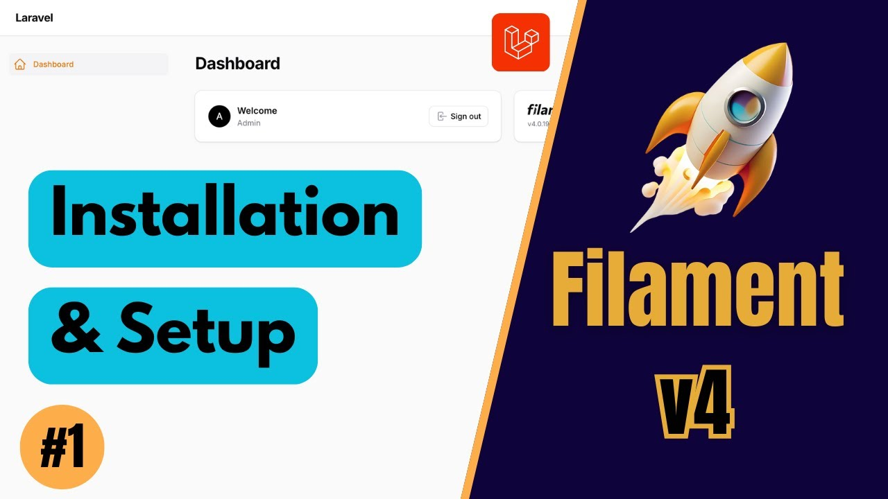
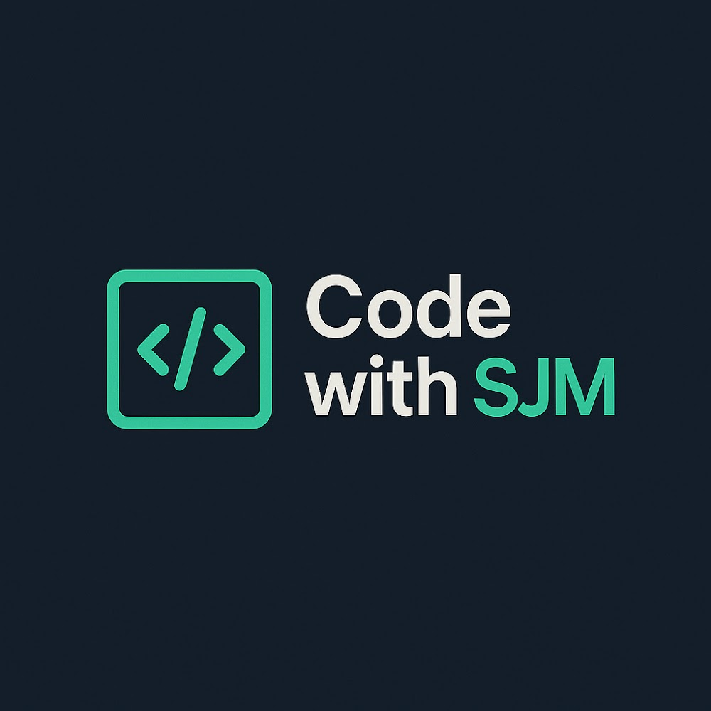
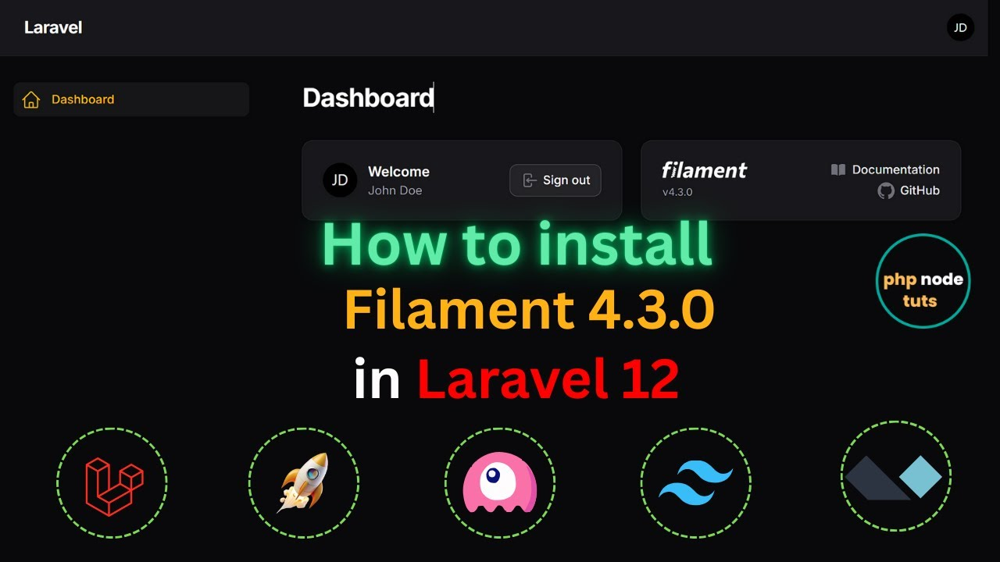
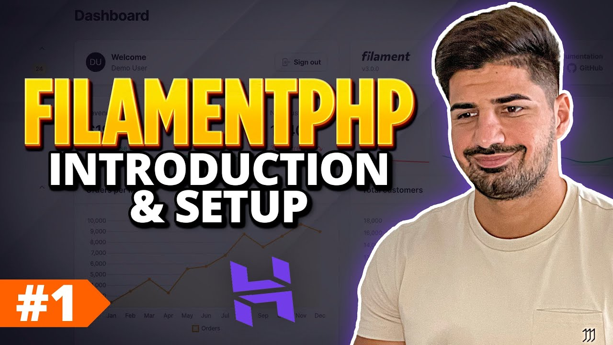
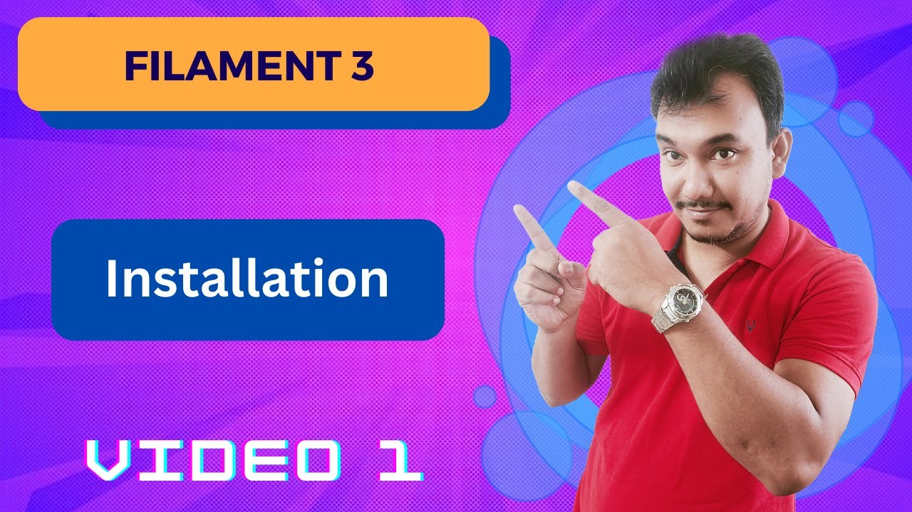
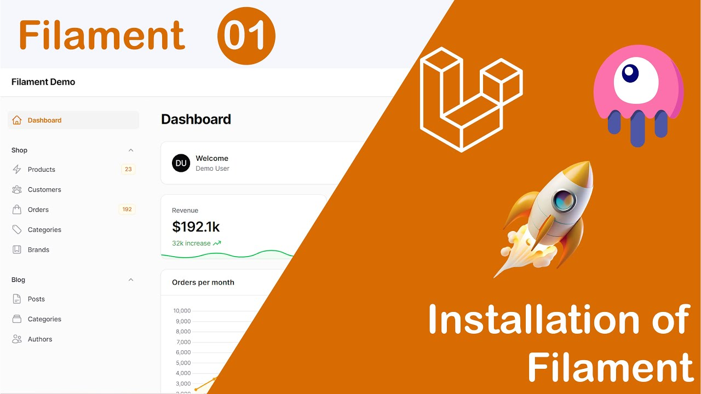
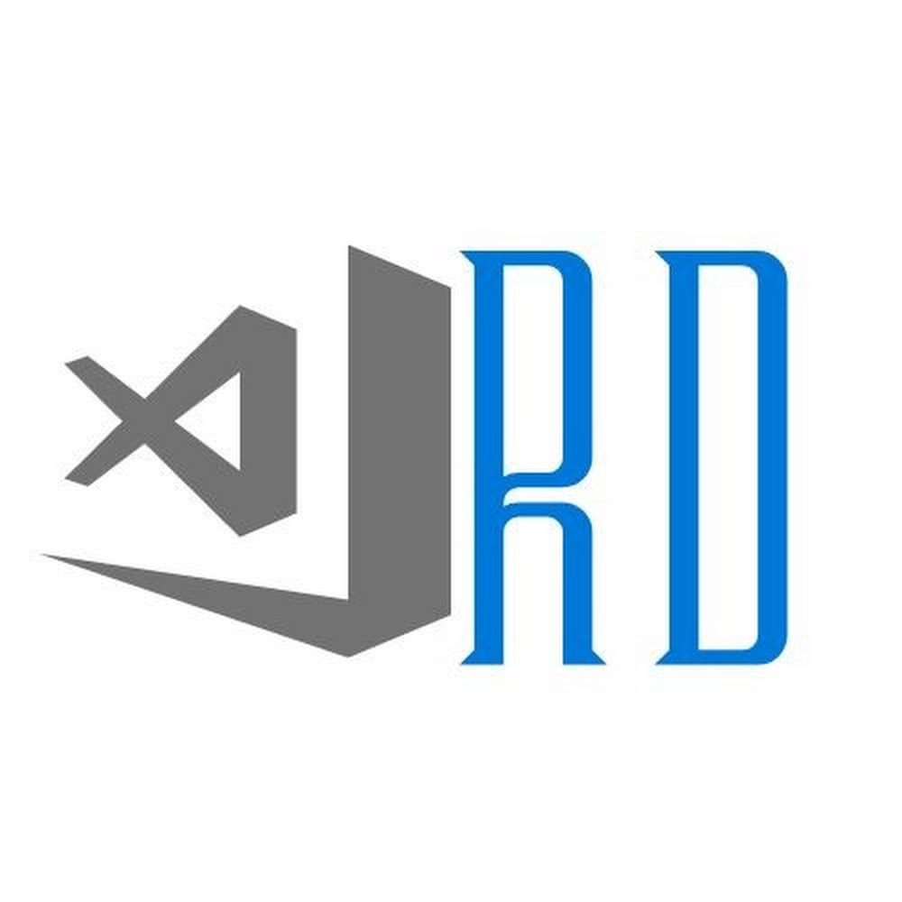

# Filament PHP Tutorials & Courses Collection

This repository contains a collection of playlists & courses for learning Filament PHP versions 3 and 4.

> ⚠️ **Important Note**  
> This list is presented **without ranking, priority, or recommendation of any specific creator**.  
> Each content creator offers their own unique approach to learning.

---

<h3 align="center">📚 Filament 4 – Courses & Tutorials</h3>

| Playlist | Creator | Scope |
|---------|------|------|
| <a href="https://www.youtube.com/playlist?list=PLxZ3SvXewFlARsNUjh7zsSXbw2shM9eIO">
<strong>Filament PHP v4 Course for beginners</strong> 
</a> | 
<a href="https://www.youtube.com/@itsolutionstuff"><strong>Hardik Savani (ItSolutionStuff)</strong> </a>
 | 
33 videos
 |
| <a href="https://www.youtube.com/playlist?list=PLjCZ5YN4HlaeW5LRx3ZWfBCikQk01KCDw">
<strong>Filament V4 Beginner to Intermediate Course</strong> 
</a> | 
<a href="https://www.youtube.com/@tillythecoder"><strong>Tilly The Coder</strong> </a>
 | 
19 videos
 |
| <a href="https://www.youtube.com/playlist?list=PLdj_kazFZvyx2QLoJke9MZPirn6TIsjY-">
<strong>Filament PHP v4 Mastery &#124; Complete Tutorial</strong> 
</a> | 
<a href="https://www.youtube.com/@codewithsjm"><strong>code with SJM</strong> </a>
 | 
9 videos
 |
| <a href="https://www.youtube.com/playlist?list=PLgh34MxUBPkhERD_HOVNQyj5IwrYjZOpR">
<strong>Filamentphp v4 Mastery</strong> 
</a> | 
<a href="https://www.youtube.com/@dosenngoding"><strong>Dosen Ngoding</strong> </a>
 | 
6 videos
 |
| <a href="https://www.youtube.com/playlist?list=PLxrGZ-lMH-c5ybR8qhhV4PD4d4qieN0sL">
<strong>Filament 4</strong> 
</a> | 
<a href="https://www.youtube.com/@phpnodetuts"><strong>PHP Node Tuts</strong> </a>
 | 
5 videos
 |

---

<h3 align="center">📚 Filament 3 – Courses & Tutorials</h3>

| Playlist | Creator | Scope |
|---------|------|------|
| <a href="https://www.youtube.com/playlist?list=PLqDySLfPKRn6fgrrdg4_SmsSxWzVlUQJo">
<strong>Filament 3 course for beginners</strong> 
</a> | 
<a href="https://www.youtube.com/@YeloCode"><strong>Yelo Code</strong> </a>
 | 
23 videos
 |
| <a href="https://www.youtube.com/playlist?list=PL6tf8fRbavl3jfL67gVOE9rF0jG5bNTMi">
<strong>Filament PHP V3 Tutorial</strong> 
</a> | 
<a href="https://www.youtube.com/@tonyxhepa"><strong>Tony Xhepa</strong> </a>
 | 
20 videos
 |
| <a href="https://www.youtube.com/playlist?list=PLFHz2csJcgk_M6tg-f589Myy-lbLyACKi">
<strong>Mastering FilamentPHP for Beginners</strong> 
</a> | 
<a href="https://www.youtube.com/@codewithdary"><strong>Code With Dary</strong> </a>
 | 
15 videos
 |
| <a href="https://www.youtube.com/playlist?list=PLkZU2rKh1mT9iHERW3cYQRO8KKjk4bOSC">
<strong>Learning FlamentPHP 3</strong> 
</a> | 
<a href="https://www.youtube.com/@amitavroy"><strong>Amitav Roy</strong> </a>
 | 
8 videos
 |
| <a href="https://www.youtube.com/playlist?list=PLa9jxxDE6i_3RBE-XCE7xFp2kXinCgzVh">
<strong>Filament From scratch</strong> 
</a> | 
<a href="https://www.youtube.com/@laraphant"><strong>LaraPhant</strong> </a>
 | 
5 videos
 |
| <a href="https://www.youtube.com/playlist?list=PLDQQdoXdVyaZCmI9HBmlxkhFEFFnVpoFF">
<strong>Filament Livewire</strong> 
</a> | 
<a href="https://www.youtube.com/@codewithrd"><strong>Code with RD</strong> </a>
 | 
4 videos
 |

---

<h3 align="center">💡 Tips & Tricks</h3>

| Channel | Description |
|------|------|
| 
<a href="https://www.youtube.com/@FilamentDaily/videos"><strong>Filament Daily</strong> </a>
 | Channel specializing in quick tips and tricks for Laravel Filament. |

---

## 🤝 Contributing
Have another course or playlist to add?  
Pull requests are welcome! 🙌